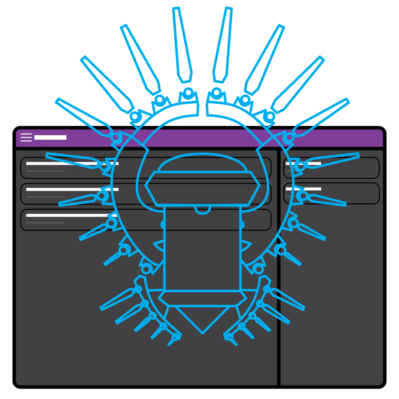

# TaskMaster III "Star Dream"
## A multiplatform application to help students get their school assignments in check. 
#### NOTICE: This application is still in development alpha, and it is not finished. If you want to compile and use it, remember, there ain't much to do yet.
#### Do you want to use Version I or II? They are not released despite being finished. Why? Well, I didn't like them much, and so did the target audience.

### Compile Tauri app and start in Development Mode
```
yarn tauri:serve
```

### Compile the Tauri application to your current platform (Production Mode)
```
yarn tauri:build
```

<!-- ### Customize configuration -->
<!-- See [Configuration Reference](https://cli.vuejs.org/config/). -->
